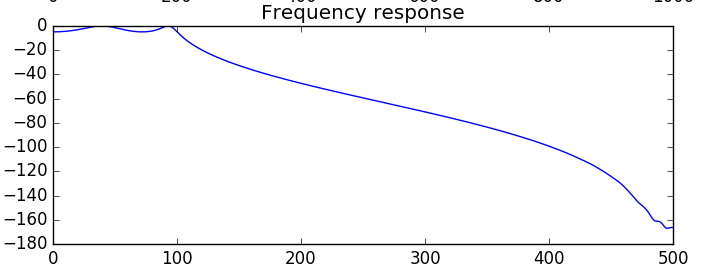

# IIR1



A powerful realtime C++ filter library for Linux, Mac OSX and Windows which
implements all standard IIR filters such as Bessel, Butterworth, RBJ
and Chebychev as low/high/band or stopband filter.

The filter processes the data sample by sample as it arrives and
accepts both float and double numbers which are
automatically converted to the internal representation which is
double.

Because the processing is sample by sample it's straightforward to
cascade different filters to create more complex responses at low
latencies.

The filter uses templates so that it can be completely
specified at compile time and is ready to be used when the software
starts without any additional memory allocation. This guarantees
maximum performance and won't require malloc/new on embedded systems.

In terms of the coefficients there is no need to resort to
MATLAB/OCTAVE/Python to calculate them because the
library does it by itself. Just provide the sampling rate, cutoff
frequency, filter order and the filter is ready to be used. For
example for a lowpass:

## How to use the filter
Usage is straightforward: first the filter parameters are set and
then it's ready to be used for sample by sample realtime filtering.

### Setting the filter parameters
```
const int order = 4; // 4th order (=2 biquads)
Iir::Butterworth::LowPass<order> f;
const float samplingrate = 1000; // Hz
const float cutoff_frequency = 5; // Hz
f.setup (samplingrate, cutoff_frequency);
```
       
### Realtime filtering sample by sample
```
float y = f.filter(x);
```

## Packages for Ubuntu (xenial / bionic):

If you have Ubuntu xenial or bionic then
install it as a pre-compiled package:

```
sudo add-apt-repository ppa:berndporr/usbdux
```

It's available for 32,64 bit PC and 32,64 bit ARM ( = Raspberry PI)

## Compilation from source

The build tool is `cmake` which generates the make- or project
files for the different platforms. `cmake` is available for
Linux, Windows and Mac. It also compiles directly on a
Raspberry PI.

### Linux / Mac

Run
```
cmake .
```
which generates the Makefile. Then run:
```
make
sudo make install
```
which installs it under `/usr/local/lib` and `/usr/local/include`.

### Windows

```
cmake -G "Visual Studio 15 2017 Win64" .
```

See `cmake` for the different build-options. Above is for a 64 bit build.
Then start Visual C++ and open the solution. This will create
the DLL and the LIB files. Under Windows it's highly recommended
to use the static library and link it into the application program.

### Unit tests

Run unit tests by typing `make test` or just `ctest`.
These test if after a delta pulse all filters relax to zero and
that their outputs never become NaN.

## Usage / Documentation

The easiest way to learn is from the examples which are in the `demo`
directory. A delta pulse as a test signal is sent into the different
filters and saved as a file. With the Python script
`plot_impulse_fresponse.py` you can then plot the frequency responses.

Also the directory containing the unit tests provides examples for
every filter type.

For an overview of the class structure and general concepts have a
look at Documentation.txt.

Run `doxygen` to generate the documented class hierachy on the basis of
the comments in the header files. The file format is HTML and will be
stored in the `doc` subdirectory.

## Credits

This library has been adapted form Vinnie Falco's
original work which can be found here:

https://github.com/vinniefalco/DSPFilters

While his original library processes audio arrays this
library has been adapted to do realtime processing sample
by sample. The filter design routines are identical to
DSPFilters.

Enjoy!

Bernd Porr
