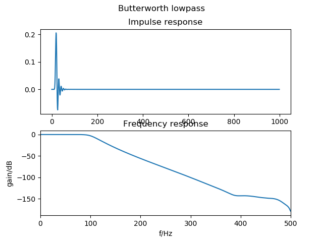
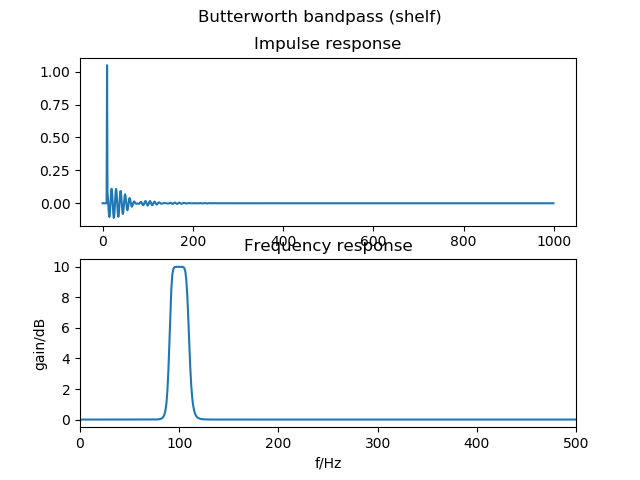
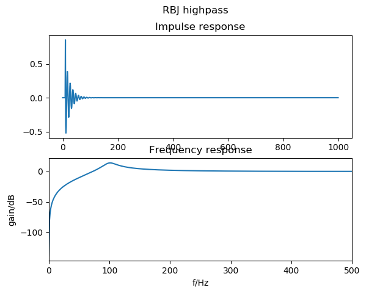
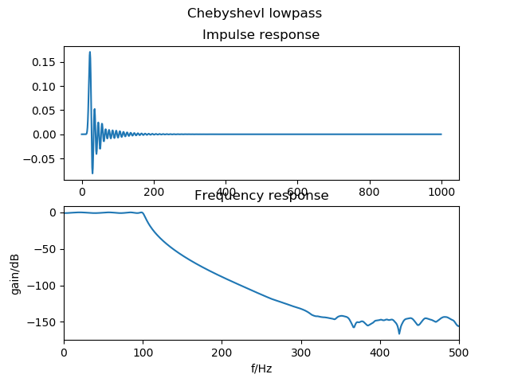
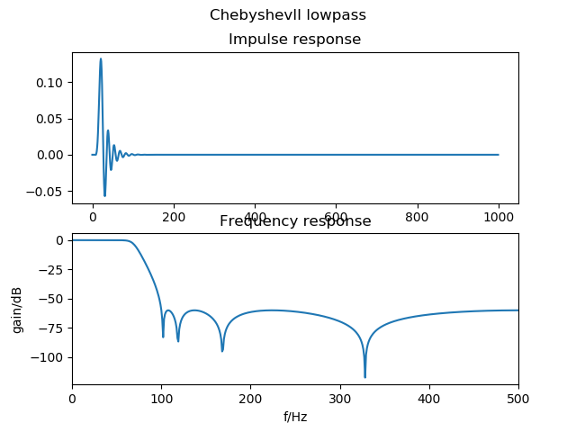
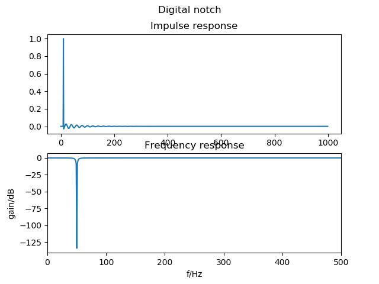
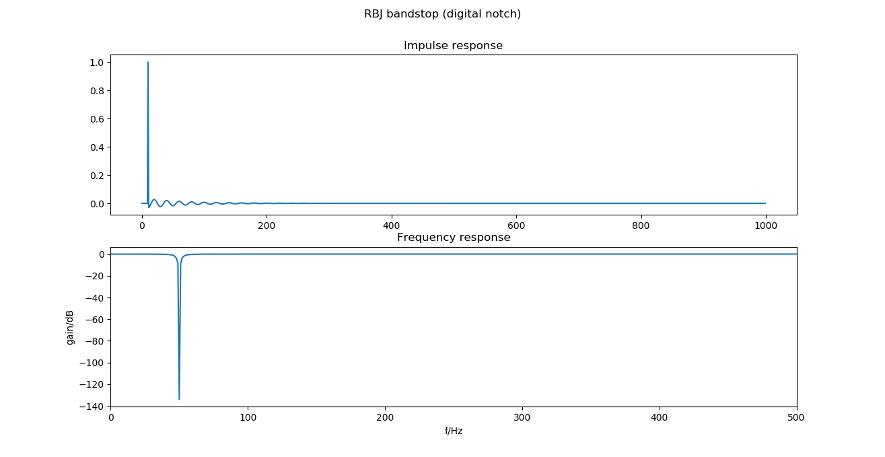

# IIR1 -- Realtime C++ filter library


An infinite impulse response (IIR) filter library for
Linux, Mac OSX and Windows
which implements Butterworth, RBJ, Chebychev filters
and can easily import coefficients generated by Python (scipy).

The filter processes the data sample by sample for realtime
processing.

It uses templates to allocate the required memory so that
it can run without any malloc / new commands.
Memory is allocated at compile time
so that there is never the risk of memory leaks.

## C++ code
Add the following include statement to your code:
```
#include "Iir.h"
```

The general coding approach is that first the filter is
instantiated specifying its order, then the
parameters are set with the function `setup` and
then it's ready to be used for sample by sample realtime filtering.

### Setting the filter parameters
All filters are available as lowpass, highpass, bandpass and bandstop/notch
filters. Butterworth / Chebyshev offer also low/high/band-shelves with
specified passband gain and 0dB gain in the stopband.

See the header files in `\iir` or the documentation for the arguments
of the `setup` commands.

The examples below are for lowpass filters:

1. Butterworth -- `Butterworth.h`
Standard filter suitable for most applications. Monotonic response.
```
const int order = 4; // 4th order (=2 biquads)
Iir::Butterworth::LowPass<order> f;
const float samplingrate = 1000; // Hz
const float cutoff_frequency = 5; // Hz
f.setup (samplingrate, cutoff_frequency);
```


2. Chebyshev Type I -- `ChebyshevI.h`
With permissible passband ripple in dB.
```
Iir::ChebyshevI::LowPass<order> f;
const float passband_ripple_in_db = 5;
f.setup (samplingrate,
         cutoff_frequency,
         passband_ripple_in_dB);
```


3. Chebyshev Type II -- `ChebyshevII.h`
With worst permissible stopband rejection in dB.
```
Iir::ChebyshevII::LowPass<order> f;
double stopband_ripple_in_dB = 20;
f.setup (samplingrate,
         cutoff_frequency,
         stopband_ripple_in_dB);
```


4. RBJ -- `RBJ.h`
2nd order filters with cutoff and Q factor.
```
Iir::RBJ::LowPass f;
const float cutoff_frequency = 100;
const float Q_factor = 5;
f.setup (samplingrate, cutoff_frequency, Q_factor);
```

5. Designing filters with Python's scipy.signal -- `Custom.h`
```
########
# Python
# See "elliptic_design.py" for the complete code.
from scipy import signal
order = 4
sos = signal.ellip(order, 5, 40, 0.2, 'low', output='sos')
print(sos) # copy/paste the coefficients over & replace [] with {}

///////
// C++
// part of "iirdemo.cpp"
const double coeff[][6] = {
		{1.665623674062209972e-02,
		 -3.924801366970616552e-03,
		 1.665623674062210319e-02,
		 1.000000000000000000e+00,
		 -1.715403014004022175e+00,
		 8.100474793174089472e-01},
		{1.000000000000000000e+00,
		 -1.369778997100624895e+00,
		 1.000000000000000222e+00,
		 1.000000000000000000e+00,
		 -1.605878925999785656e+00,
		 9.538657786383895054e-01}
	};
const int nSOS = sizeof(coeff) / sizeof(coeff[0]); // here: nSOS = 2
Iir::Custom::SOSCascade<nSOS> cust;
cust.setup(coeff);
```

### Realtime filtering sample by sample
Samples are processed one by one. In the example below
a sample `x` is processed with the `filter`
command and then saved in `y`. The types of `x` and `y` can either be
float or double
(integer is also allowed but is still processed internally as floating point):
```
y = f.filter(x);
```
This is then repeated for every incoming sample in a
loop or event handler.


### Error handling
Invalid values provided to `setup()` will throw
an exception. Parameters provided to `setup()` which
result in coefficients being NAN will also
throw an exception.


## Linking

### CMake setup
If you use cmake as your build system then just add
to your `CMakeLists.txt` the following lines for the dynamic library:
```
find_package(iir)
target_link_libraries(... iir::iir)
```
or for the static one:
```
find_package(iir)
target_link_libraries(... iir::iir_static)
```

### Generic linker setup
Link it against the dynamic library
(Unix/Mac: `-liir`, Windows: `iir.lib`)
or the static library (Unix/Mac: `libiir_static.a`,
Windows: `libiir_static.lib`).


## Packages for Ubuntu (xenial / bionic):

If you have Ubuntu xenial or bionic then
install it as a pre-compiled package:

```
sudo add-apt-repository ppa:berndporr/usbdux
```

It's available for 32,64 bit PC and 32,64 bit ARM (Raspberry PI etc).
The documentation and the example programs are in:
```
/usr/share/doc/iir1-dev/
```

## Compilation from source

The build tool is `cmake` which generates the make- or project
files for the different platforms. `cmake` is available for
Linux, Windows and Mac. It also compiles directly on a
Raspberry PI.

### Linux / Mac

Run
```
cmake .
```
which generates the Makefile. Then run:
```
make
sudo make install
```
which installs it under `/usr/local/lib` and `/usr/local/include`.

Both gcc and clang have been tested.

### Windows

```
cmake -G "Visual Studio 15 2017 Win64" .
```

See `cmake` for the different build-options. Above is for a 64 bit build.
Then start Visual C++ and open the solution. This will create
the DLL and the LIB files. Under Windows it's highly recommended
to use the static library and link it into the application program.

### Unit tests

Run unit tests by typing `make test` or just `ctest`.
These test if after a delta pulse all filters relax to zero and
that their outputs never become NaN.

## Documentation

### Learn from the demos
The easiest way to learn is from the examples which are in the `demo`
directory. A delta pulse as a test signal is sent into the different
filters and saved in a file. With the Python script
`plot_impulse_fresponse.py` you can then plot the frequency responses.

Also the directory containing the unit tests provides examples for
every filter type.

### Detailed documentation
A PDF of all classes, methods and in particular `setup` functions
is in the `doc/pdf` directory.

Run `doxygen` to generate the HTML documentation.

## Example filter responses

These responses have been generated by `iirdemo.cpp`
in the `/demo/` directory and then plotted with `plot_impulse_fresponse.py`.









## Credits

This library has been further developed from Vinnie Falco's
great original work which can be found here:

https://github.com/vinniefalco/DSPFilters

While the original library processes audio arrays this
library has been adapted to do fast realtime processing sample
by sample. The `setup`
command won't require the filter order and instead remembers
it from the template argument. The class structure has
been simplified and all functions documented for doxygen.
Instead of having assert() statements this libary throws
exceptions in case a parameter is wrong. Any filter design
requiring optimisation (for example Ellipic filters) has
been removed and instead a function has been added which can import easily
coefficients from scipy.

## Bibliography

```
  "High-Order Digital Parametric Equalizer Design"
   Sophocles J. Orfanidis
   (Journal of the Audio Engineering Society, vol 53. pp 1026-1046)

  "Spectral Transformations for digital filters"
   A. G. Constantinides, B.Sc.(Eng.) Ph.D.
   (Proceedings of the IEEE, vol. 117, pp. 1585-1590, August 1970)
```

Enjoy!

Bernd Porr -- http://www.berndporr.me.uk
